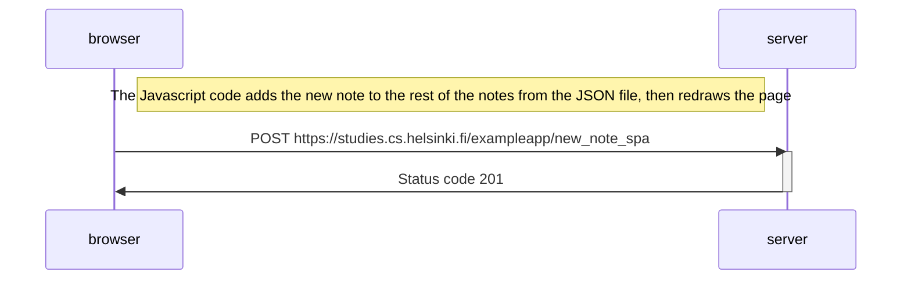

```mermaid
sequenceDiagram
    participant browser
    participant server

    Note right of browser: The Javascript code adds the new note to the rest of the notes from the JSON file, then redraws the page
    browser->>server: POST https://studies.cs.helsinki.fi/exampleapp/new_note_spa
    activate server
    server->>browser: Status code 201
    deactivate server


```
